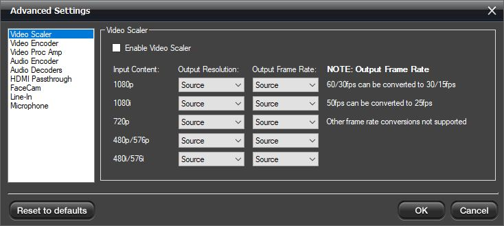
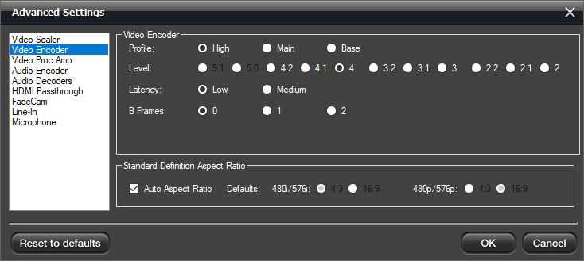
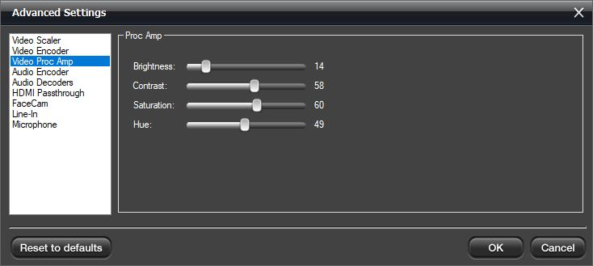
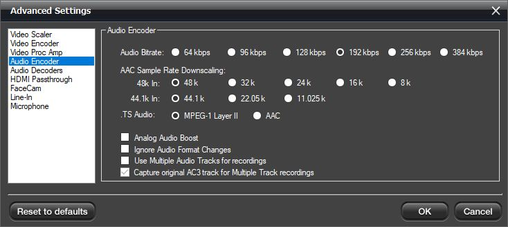
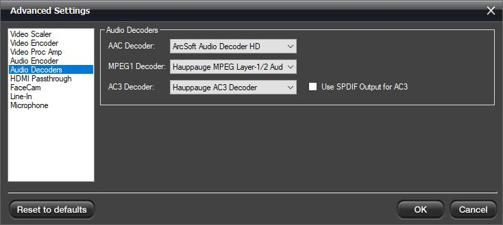
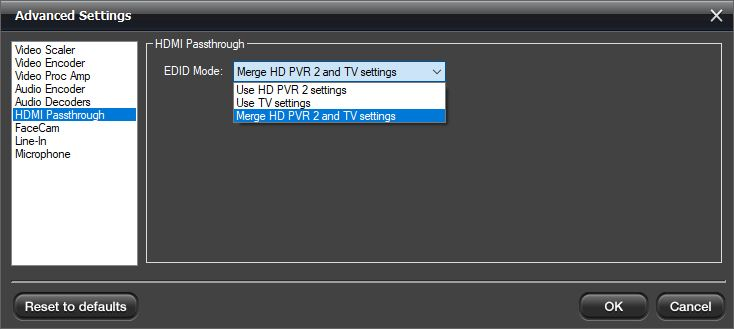
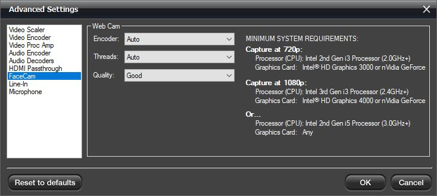
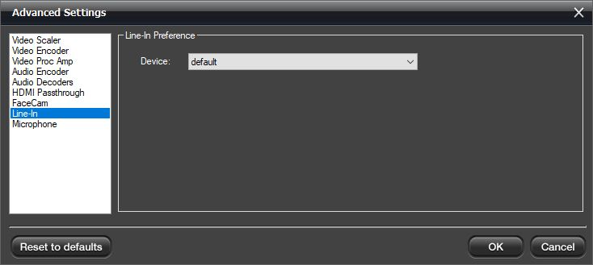
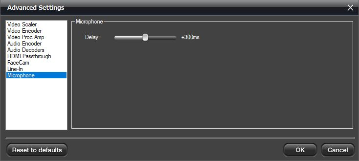

# Advanced Settings

## Video Scaler

**Enable Video Scaler**: Check this option if you wish to downscale your
video.

*Note: All settings are for downscaling, there is no upscaling.*

**Output Resolution**: This section allows you to downscale the source
resolution to a lower resolution.

*Note: only certain resolutions can be used based on the source
resolution. Selecting "Source" indicates no scaling.*

**Output Frame Rate**: This section allows you to downscale the frame
rate. For example, you can downscale 60fps to 30fps. Selecting
"Source" indicates no scaling.

## Video Encoder

**Video Encoder**: It sets the H.264 specification defined "Profile"
and "Level" parameters. The default settings are our recommended
values. For exact details please consult the H.264 specification online.

**Standard Definition Aspect Ratio**: Auto will be default for the
standard definition aspect ratio. If you would like to override it, you
uncheck the box and select 16:9.

## Video Proc Amp

**Video Proc Amp**: These controls adjust recording and pass-thru
picture quality.

*Note: Not all of these controls have an effect and are model specific.*

## Audio Encoder

These settings affect the audio capture.

**AAC Bitrate**: This lets you change the AAC encoding bitrate. The
default is 192kbps.

**AAC Sample Rate Downscaling**: The sample rate is based on the source
audio.

The source is either 48k or 44.1k, but you can't tell what is coming
in. All you can do is downscale to the choice you want.

**.TS Audio**: In two-channel audio or when recording with voice audio,
you can change how audio is encoded.

**Analog Boost**: Increases the audio level for left and right analog
audio sources.

**Ignore Audio Format Changes**: When unchecked, if the audio changes
from 2ch to 5.1 or vice versa, the video preview will reset. When
checked it will ignore the change and stay in the current mode.

**Use Multiple Audio Tracks for recordings**: This will split the
recorded audio into separate tracks. Mic audio on its track, PC audio on
its track, etc. In case you would like to edit them separately.

**Capture original AC3 track for Multiple Track recordings**: In
multi-track audio, it keeps the original 5.1 stream rather than
downmixing from 5.1 via audio mixer to 2ch.

## Audio Decoders

Audio Decoders are used for playback of audio in Hauppauge Capture. They
do not change how audio is captured. Audio decoders are provided but can
be changed with third-party decoders if you wish.

## HDMI Passthrough

**EDID Mode**: (Extended Display Identification Data) is a small
configuration file stored on devices that contains information about the
type of signal the device can accept, such as resolution, frame rate,
audio, and much more. This information is transmitted from our capture
device to the monitor it is connected to.

**Merge HD PVR 2 and TV Settings**: This is the default mode. It
combines our capture device capabilities and TV information for the best
functionality.

**Use HD PVR 2 Settings**: This will force the use of the capabilities
of our devices to be passed on to the TV.

**Use TV Settings**: This will force the HD PVR 2 to accept what the TV
is capable of receiving.

## Facecam

**Encoder**: Auto uses the h.264 encoder chip on the device, while
Software Encoder uses your CPU to encode the video.

**Threads**: Uses your CPU threads to help process the webcam video.
Auto is the default.

**Quality**: The default is Good quality, but you can reduce it to Low
or increase it to Best.

## Line-In

**Device**: This allows you to record from the Line-In of your PC as the
audio source.

## Microphone

**Microphone**: Adjusts delay of microphone audio to game audio in
milliseconds.
