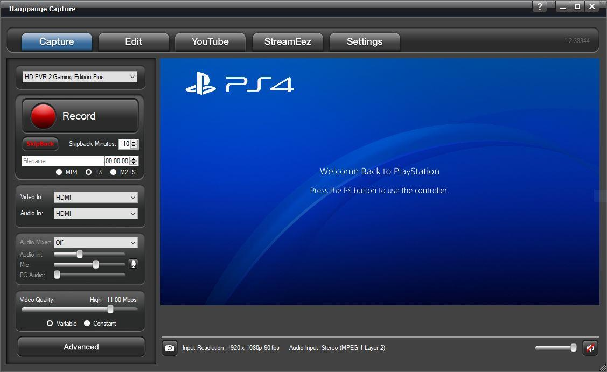
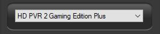
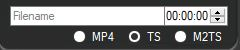
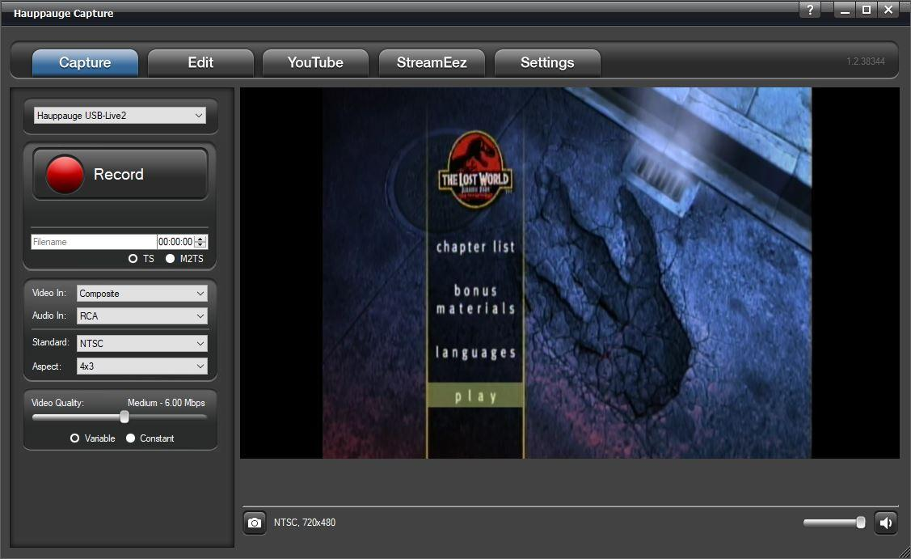

# Capture Tab

## PVR Products

The following options are for Personal Video Recorder products such as
the HD PVR, HD PVR 2, HD PVR Rocket, HD PVR Pro 60, Colossus, and
Colossus 2.

**Device Dropdown:** These settings will list Hauppauge capture devices
on your system if you have multiple devices. At the moment the following
devices are supported by Hauppauge Capture. HD PVR, HD PVR 2, HD PVR
Rocket, HD PVR Pro 60, Colossus, Colossus 2. As well these analog
devices Impact VCB-e, and USB-Live2.

**Record**: Click it to start recording. Click it to stop when recording
or use the push button on the top of the HD PVR 2, HD PVR Rocket, or HD
PVR Pro 60 to start and stop recordings.

**SkipBack**: If enabled, the Hauppauge Capture application will begin
recording as soon as the application is opened. SkipBack sets the amount
of buffer recording time the application will store. For example, if the
application has been opened for 20 minutes and the Skipback is set to 10
minutes when you press the Record button your recording will include the
previous 10 minutes before you pressed the Record button.

**Filename**: You can type your filename or leave the default filename
layout which is HDPVR2_Yr/Mo/Day_Hr/Min. A timer is available on the
right to record for a specified amount of time. For example, if you
select 10:00. It will countdown for 10 minutes and stop recording.

**File Type**: Three options are available for recording. They are
Transport Stream or TS is our default capture format. MPEG-2 Transport
Stream or .m2ts is a Blu-ray format. MPEG-4 Part 14 or .mp4 is best for
online sharing.

*Note: Analog products do not have the .mp4 file option. Also, our
original HD PVR is not supported.*

**Video Input**: Click the dropdown to choose your video input (HDMI,
Component, S-Video, or Composite).

**Audio Input**: Click the dropdown to choose your audio Input (AV IN,
SPDIF (Optical), HDMI, or LineIn PC).

**Audio Mixer**: Click the dropdown to turn ON the audio mixer with or
without a microphone. If a microphone is connected, it will show up on
the dropdown menu. There are separate volume controls for Audio In, Mic,
and PC Audio so you can find the correct audio balance.

**Video Quality**: You can adjust the bitrate of your recordings. The
higher the bitrate the better the video quality but also makes the file
size larger. You can also select if you would like to capture in
variable bitrate or constant bitrate.

*Note: The HD PVR Pro 60 and HD PVR Rocket can only capture in variable
bitrate.*

**Advanced**: Click to open the Advanced menu.

**Camera button**: Use this to snap still frame images. Files by default
are stored at C:\\Users\\Public\\Public Videos\\

**Input resolution**: This indicates the input resolution that Hauppauge
Capture is detecting from the source (game console, set-top box, PC,
etc.).

**Audio Input**: This indicates the audio input that Hauppauge Capture
is detecting from the source.

**Volume Control**: Slide bar and **Mute** button are on the lower
right.

## Analog Products

**Device Dropdown:** These settings will list Hauppauge Capture devices
on your system if you have multiple devices. At the moment the following
devices are supported by Hauppauge Capture for analog. The Impact VCB-e
and USB-Live2.

**Record**: Click it to start recording and click it to stop when
recording.

**Filename**: You can type your filename or leave the default filename
layout which is Analog_Yr/Mo/Day_Hr/Min. A timer is available on the
right to record for a specified amount of time. For example, if you
select 10:00. It will countdown for 10 minutes and stop recording.

**File type**: Only TS and M2TS formats are available. They are
Transport Stream or TS is our default capture format. MPEG-2 Transport
Stream or M2TS is a Blu-ray format.

**Video In**: Click the dropdown to choose your video input (Composite
or S-Video).

**Audio In**: Audio can only be RCA.

**Standard**: Click the dropdown to choose your video standard (NTSC,
PAL, NTSC-J, or SECAM). The software will make the change after a few
seconds. No need to close and reopen Hauppauge Capture.

**Aspect**: Click the dropdown menu to capture in 4:3 or 16:9 ratio. The
software will make the change after a few seconds. No need to close and
reopen Hauppauge Capture.

**Video Quality**: You can adjust the bitrate of your recordings. The
higher the bitrate the better the video quality but also makes the file
size larger. You can also select if you would like to capture in
variable bitrate or constant bit rate.
