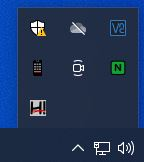
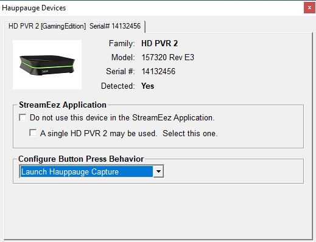

# Hauppauge Device Central

Hauppauge Device Central is a tool installed with Hauppauge Capture. It
allows you to modify what the button on top of the HD PVR 2, HD PVR
Rocket, HD PVR Pro 60 will do.

You can open Hauppauge Device Central by clicking on the icon in the
taskbar.

You can select in the Hauppauge Devices application that opens the
behavior of the button on the device. By default, it should open
Hauppauge Capture and start recording.

If the Hauppauge Device Central icon is not on your taskbar, you can
manually reopen it by navigating to the following shortcut.

C:\\Program Files (x86)\\Hauppauge\\DeviceCentral\\HcwDCTrayTool.exe
