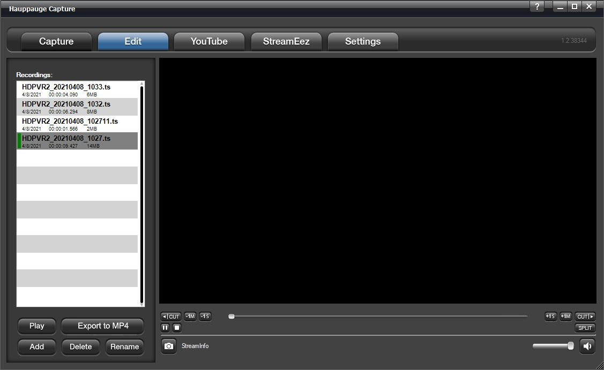
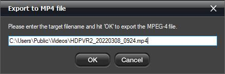
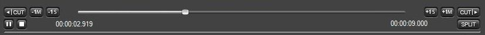

# Edit Tab

**Recordings**: The recorded files will be listed here. Click the
recording with which you wish to work with.

**Play**: Click to play your file. You can
 stop or
 pause
 play your file with the buttons located
below the  cut left button below the playback
window on the left.

**Export to MP4**: Files captured in TS or M2TS can be exported to MP4
after already being captured.

*Note: files can only be exported to MP4, but you can't edit MP4 files.
Only .TS and .M2TS files can be edited by Hauppauge Capture.*

**Add**: Use to import a file into the editor file list.

**Delete**: Click to delete a recording or edited file. A file deleted
through the application will be completely deleted and will not go to
the recycling bin.

**Rename**: Click to rename a file. If a file is currently open, you
must hit stop first before renaming the file.

## Using the Cuts Editor

You can navigate through your clip using the slider or just watch your
video to find your cut points. You can also use the back button
 and forward button
 to move in 1-minute increments. Use the
 and
 for one-second increments.

If you wish to cut off the first minute of the clip navigate there and
click the  button. This will remove the first minute and
recreates the file. The same thing applies if you wish to remove
something from the back end. Find the spot and click the
 button. The
 button will let you split the file and
will create two files at the point you choose.

This is a simple cuts editor. If you need to put the pieces together to
create a new file you will need to copy the clips you wish to work with
into a third-party video editor.
