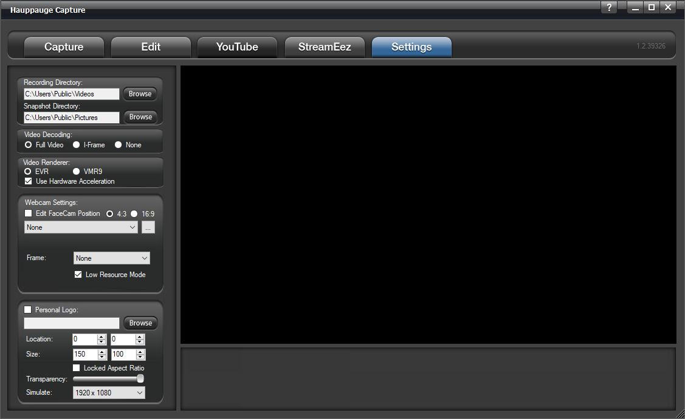
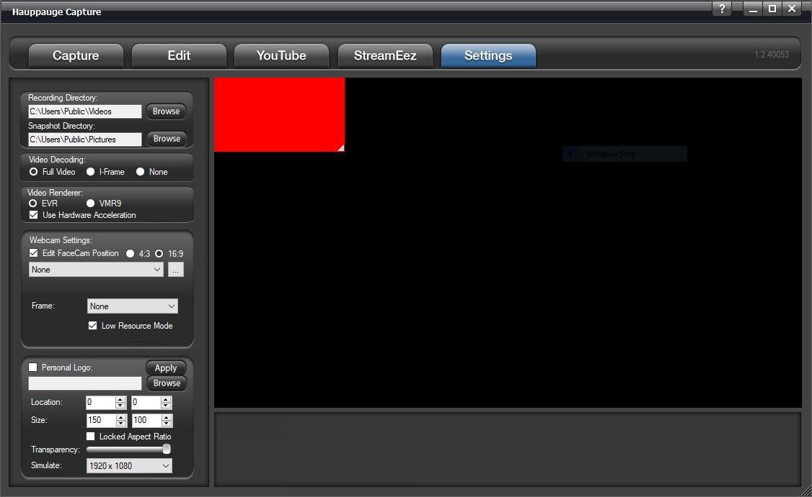
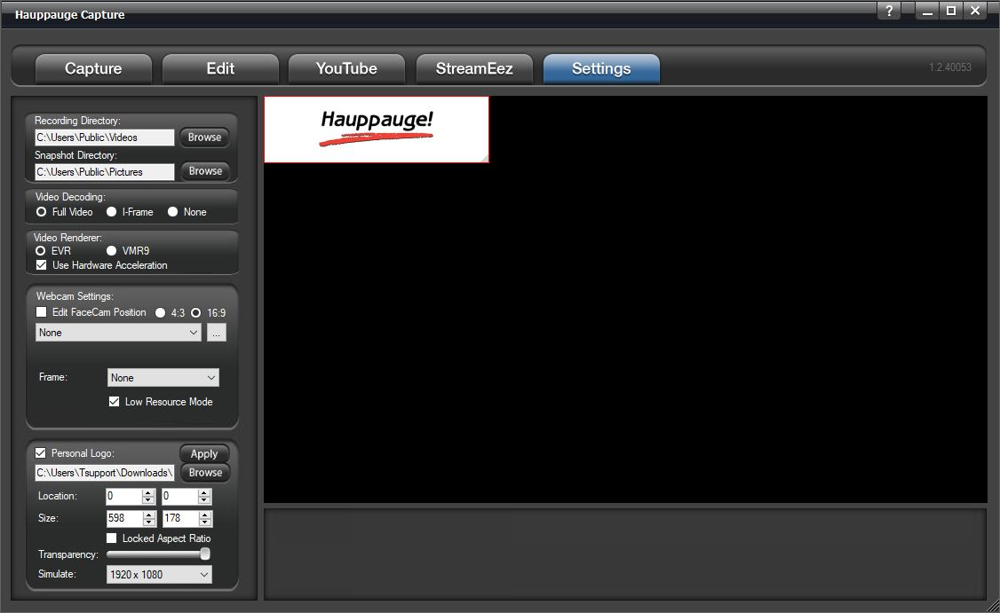

# Settings Tab

**Recordings Directory**: Default location listed. You can change the
video directory here.

**Snapshot Directory**: Default location listed. You can change the
snapshot directory here.

**Video Decoding**:

**Full Video**: video preview will show all frames of the video.

**I-Frames only**: video preview will only show I-frames (every 2
seconds of video) use this setting to help smooth out the preview on
slower systems or low-end graphics systems.

**None**: No preview at all. Video will still record and audio will be
heard.

**Video Renderer**:

**EVR** or **VMR9**: Specifies the video renderer to be used. The video
renderer is a software interface to your display adapter. Changes take
effect after restarting the application.

**Use Hardware Acceleration**: This will allow your graphics system to
use hardware acceleration for video decoding.

*Note: Graphics hardware acceleration does not work on all systems. It
is a feature of your graphics chipset. Use this feature to help the
preview video if it is not smooth.*

## Webcam

You can select from the dropdown menu your webcam to use for the FaceCam
option. It would be placed above your video.

**Edit FaceCam Position**: Check this box to be able to move the FaceCam
window on the screen. You can also select if you want the screen to be in
**4:3** or **16:9** ratio.

**Frame**: The dropdown gives you multiple styles of frames to use
around your Facecam Video.

**Low Resource Mode**: Save CPU resource when FaceCam is ON. Sets Video
Decoder to "I-Frame" so it only shows 1 frame every second and also
reduces the encoded video quality to say 720p30 instead of source.

## Personal Logo

You can use the Personal Logo to add a personal logo or picture to your
recordings.

**Personal Logo**: check the box to turn on/off the personal logo.

Click the **browse** button and locate your file then select it and it
will appear in the upper left of the video window.

**Location**: select the position for your logo on the screen. You can
also move around with your mouse.

**Size**: Select the size for the personal logo on the screen. You can
also drag in and out with your mouse.

**Transparency**: adjust the transparency of the image using the slider.

**Simulate**: drop-down and choose the resolution in which you will be
recording. This will size the image to that resolution.

When finished click **Apply** and the settings will be stored.
