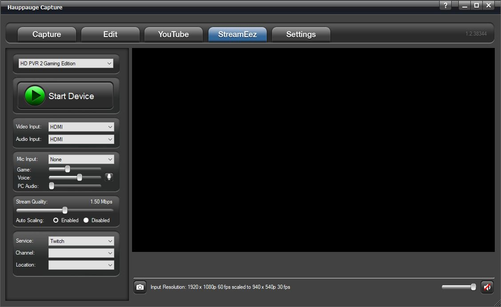
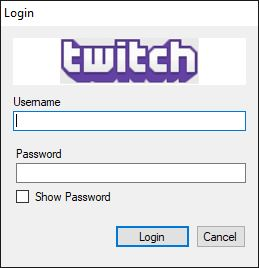
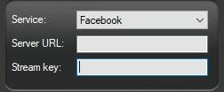
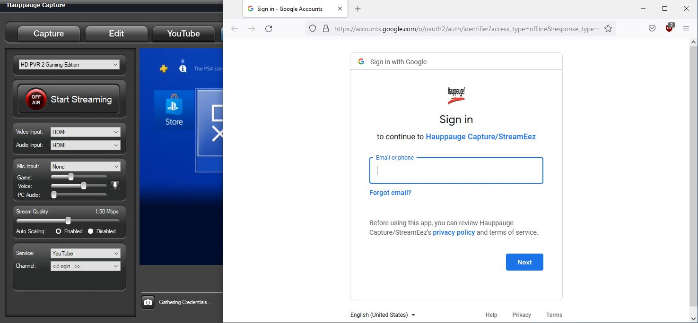
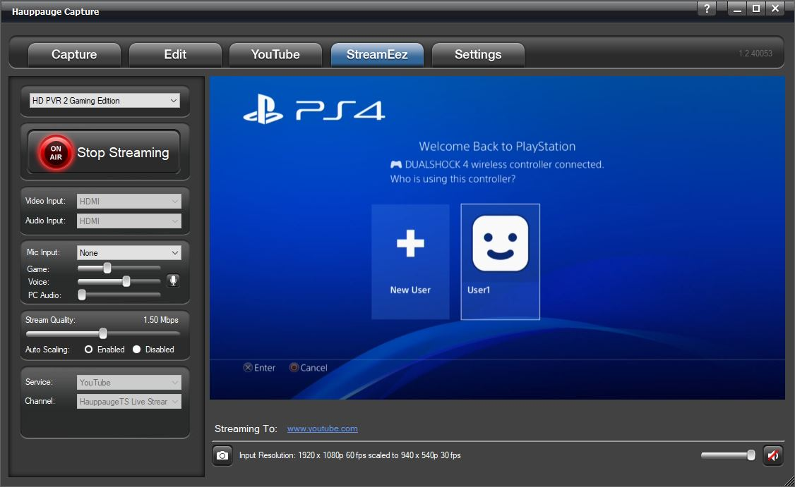
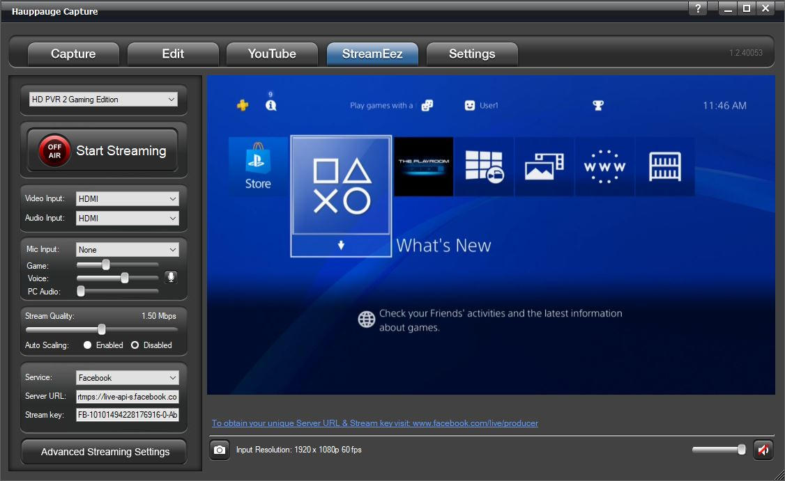

# StreamEez

StreamEez will let you Stream your video with Facebook, Twitch, and
YouTube.

## Using StreamEez

*Note: you must have a valid account with Facebook, Twitch, or YouTube.*

Select the Video and Audio Inputs that you are using and then click
**Start Device**.

Adjust the **Microphone Input** settings if needed.

**Stream Quality**: Select the upload bit rate you want to stream at
from 0.50 Mbps to 6.00 Mbps.

**Auto Scaling:** If enabled (default) it adjusts the streaming
resolution based on the stream quality. Example 1080p resolution
streamed at 0.50 Mbps can't handle 1080p, auto-scaling will change the
resolution to 640x360. If you increase stream quality to 2.00 Mbps it
will adjust it to 1280x720. If disabled it will attempt to stream at
incoming resolution. Also, Advance Streaming will become available.

**Service**: Select the streaming service, either Facebook, Twitch, or
YouTube.

**Channel**: Select the service Facebook, Twitch, or Youtube.

If you select **Twitch** you will get the following login screen.

**Location**: Once logged in, it will show you the nearest server that
you can connect to for Twitch only.

If you select **Facebook**, you will need to provide the Server URL and
Stream Key.

You can get this information by logging into your Facebook account and
going to the following link: [https://www.facebook.com/live/producer](https://www.facebook.com/live/producer)

**YouTube** will open your default browser and ask you to log in to your
Google account.

Once you set all your options. You can now press the **Start Streaming**
button.

A link will be provided at the bottom of the software to access your
stream or share it with others.

When you are done with streaming you can click on **Stop Streaming**.

## Advance Streaming Settings

When you disable Auto Scaling you will have an Advance Streaming
Settings menu available. The advanced streaming settings menu has
options for Video Scaler, Audio Encoder, and Microphone. More
information about these settings can be found on the Advanced Settings
page.
