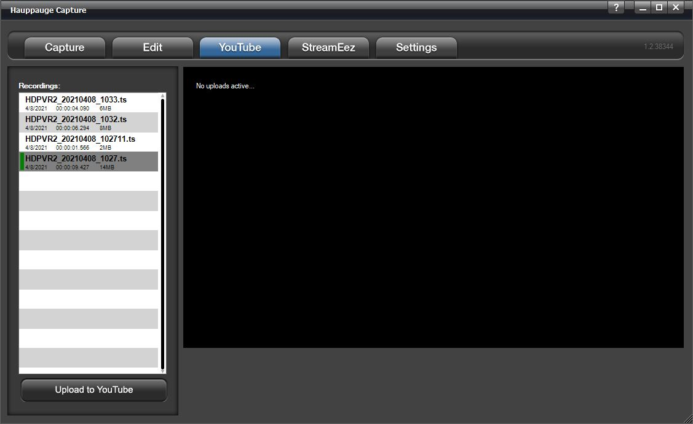
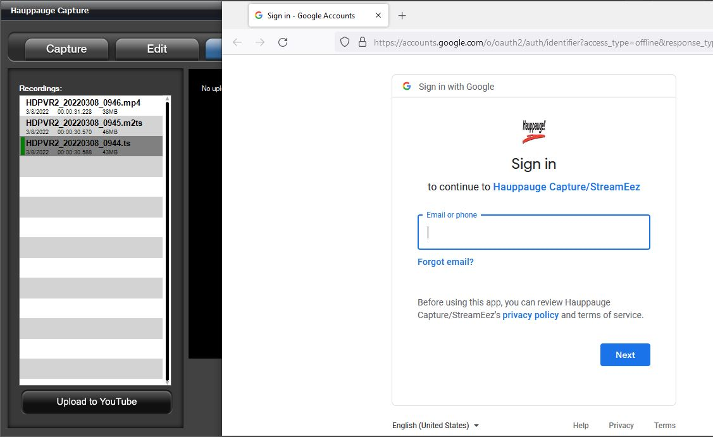
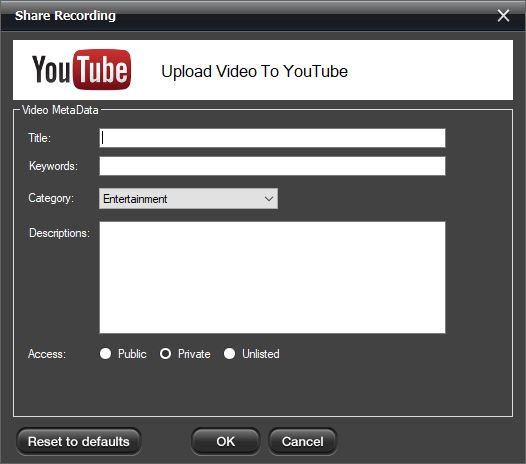
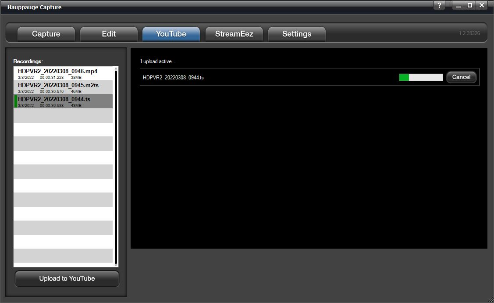

# YouTube Tab

Hauppauge Capture can upload your recorded videos directly to YouTube
within the application. All video files are uploaded in the resolution
that they were captured in.

**Recordings**: Any recordings available for uploading will be listed
here. Highlight the recording you want to upload.

## Upload to YouTube

Press the **Upload to YouTube** button and you will need to login to
your Youtube account to authorize Hauppauge Capture to upload files for
you.

Once authorized you will see the Share Recording dialog box.

*Note: All fields are required for uploading.*

## Video Metadata

YouTube is the world's second-largest search engine, and it uses
metadata - your video's title, tags, and description - to index your
video correctly. To maximize your presence in search, promotion,
suggested videos, and ad-serving, make sure your metadata is well
optimized.

**Title**: type in a title for your video.

**Keywords**: type in at least one keyword. This is essentially tags.

**Category**: Select a category for your video.

**Descriptions**: type a description for your video.

**Access**: select public and everyone can see it or private and only
you can see it while logged into your YouTube account. Unlisted and only
can be viewed with direct access to the link.

Click **OK** to upload the video. If the connection is successful you
will see the upload progress bar.

