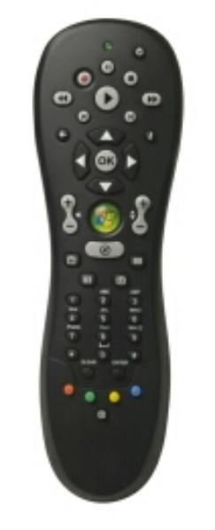
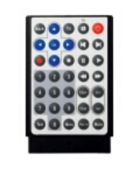
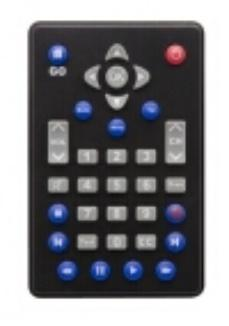
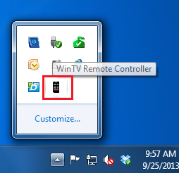
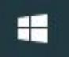
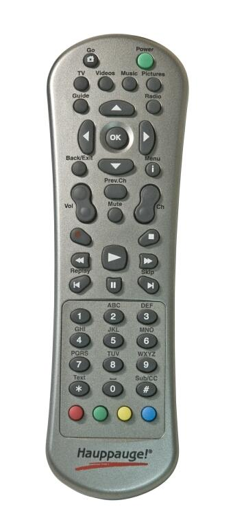
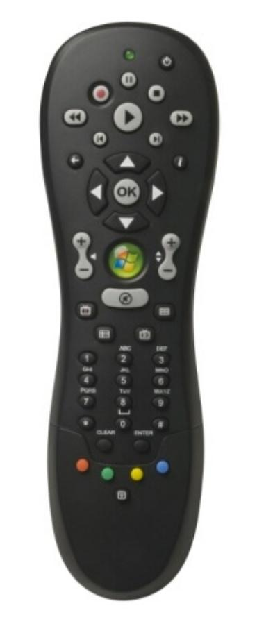
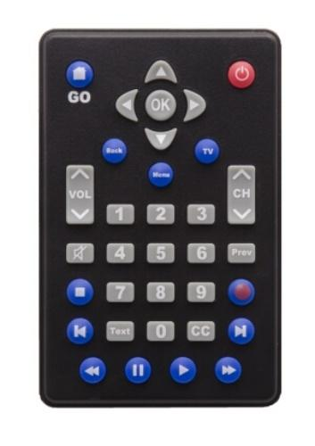

## Remote Control Buttons in WinTV 10

Some WinTV models include a remote control. Please select your remote control.

|                                       |                                   |                                    |                                    |
| ------------------------------------------------------------ | -------------------------------------------------------- | --------------------------------------------------------- | --------------------------------------------------------- |
| [Hauppauge 45 button Model](#remote-control-hauppauge-model) | [Media Center Model](#remote-control-media-center-model) | [Credit Card Size Model 1](#remote-control-credit-card-1) | [Credit Card Size Model 2](#remote-control-credit-card-2) |

### Remote Control Tray Icon

In order for the remote control to work, a **WinTV Remote Controller** application is installed during the WinTV 10 installation. This application needs to be running in the system tray in order for the remote control to work.

If the icon is not running, you can restart it by clicking on the Windows Start button   **Start button**. Then navigate to **Hauppauge WinTV** programs folder, and click on **Restart IR**.

### Remote Control Buttons in WinTV 10 {#remote-control-hauppauge-model}

Hauppauge Model

<table>
<colgroup>
<col />
<col />
<col />
<col />
</colgroup>
<thead>
<tr>
<th><strong>Button</strong></th>
<th> </th>
<th><strong>Function</strong></th>
<th></th>
</tr>
<tr>
<th>Go</th>
<th> </th>
<th>Start WinTV</th>
<th rowspan="28"></th>
</tr>
<tr>
<th>Power</th>
<th> </th>
<th>Exit WinTV</th>
</tr>
<tr>
<th>TV</th>
<th> </th>
<th>Start Live TV</th>
</tr>
<tr>
<th>Videos</th>
<th> </th>
<th>Show stream details</th>
</tr>
<tr>
<th>Music</th>
<th> </th>
<th>(no function)</th>
</tr>
<tr>
<th>Pictures</th>
<th> </th>
<th>Change aspect ratio between <em>fill</em> and <em>auto</em></th>
</tr>
<tr>
<th>Guide</th>
<th> </th>
<th>Show Now/Next info</th>
</tr>
<tr>
<th>Radio</th>
<th> </th>
<th>(no function)</th>
</tr>
<tr>
<th>Arrow left/right</th>
<th> </th>
<th>Change audio volume / 
Teletext: select next / previous subpage</th>
</tr>
<tr>
<th>Arrow up/down</th>
<th> </th>
<th>Change channel / 
Teletext: select next / previous page</th>
</tr>
<tr>
<th>OK</th>
<th> </th>
<th>Confirm selection (in channel list)</th>
</tr>
<tr>
<th>Back/Exit</th>
<th> </th>
<th>Exit full screen / 
Close channel list</th>
</tr>
<tr>
<th>i (Menu)</th>
<th> </th>
<th>Open channel list</th>
</tr>
<tr>
<th>Vol</th>
<th> </th>
<th>Change audio volume</th>
</tr>
<tr>
<th>Prev.Ch</th>
<th> </th>
<th>Select last channel</th>
</tr>
<tr>
<th>Mute</th>
<th> </th>
<th>Mute / unmute audio</th>
</tr>
<tr>
<th>Ch</th>
<th> </th>
<th>Change channel</th>
</tr>
<tr>
<th></th>
<th> </th>
<th>Start recording</th>
</tr>
<tr>
<th></th>
<th> </th>
<th>Stop recording / 
Exit Live TV</th>
</tr>
<tr>
<th></th>
<th> </th>
<th>Skip back 30 seconds</th>
</tr>
<tr>
<th></th>
<th> </th>
<th>Continue Live TV or play back</th>
</tr>
<tr>
<th></th>
<th> </th>
<th>Skip forward 30 seconds</th>
</tr>
<tr>
<th></th>
<th> </th>
<th>Skip back 60 seconds</th>
</tr>
<tr>
<th></th>
<th> </th>
<th>Pause Live TV</th>
</tr>
<tr>
<th></th>
<th> </th>
<th>Skip forward 60 seconds</th>
</tr>
<tr>
<th>0 - 9</th>
<th> </th>
<th>Enter channel preset number</th>
</tr>
<tr>
<th>* (Text)</th>
<th> </th>
<th>Display teletext (if available)</th>
</tr>
<tr>
<th># (Sub/CC)</th>
<th> </th>
<th>Display subtitles (if available)</th>
</tr>
<tr>
<th>Red button</th>
<th> </th>
<th>Start WinTV / 
Switch to full screen</th>
<th></th>
</tr>
<tr>
<th>Green button</th>
<th> </th>
<th>(no function)</th>
<th></th>
</tr>
<tr>
<th>Yellow button</th>
<th> </th>
<th>(no function)</th>
<th></th>
</tr>
<tr>
<th>Blue button</th>
<th> </th>
<th>Make snapshot</th>
<th></th>
</tr>
</thead>
<tbody>
</tbody>
</table>

### Remote Control Buttons in WinTV 10 {#remote-control-media-center-model}

Media Center Model

<table>
<colgroup>
<col />
<col />
<col />
<col />
</colgroup>
<thead>
<tr>
<th><strong>Button</strong></th>
<th> </th>
<th><strong>Function</strong></th>
<th></th>
</tr>
<tr>
<th>Power</th>
<th> </th>
<th>Exit WinTV / 
Start Windows Media Center</th>
<th rowspan="31"></th>
</tr>
<tr>
<th></th>
<th> </th>
<th>Start recording</th>
</tr>
<tr>
<th></th>
<th> </th>
<th>Pause Live TV</th>
</tr>
<tr>
<th></th>
<th> </th>
<th>Stop recording / 
Exit Live TV mode</th>
</tr>
<tr>
<th></th>
<th> </th>
<th>Skip back 30 seconds</th>
</tr>
<tr>
<th></th>
<th> </th>
<th>Continue Live TV or play back</th>
</tr>
<tr>
<th></th>
<th> </th>
<th>Skip forward 30 seconds</th>
</tr>
<tr>
<th></th>
<th> </th>
<th>Skip back 60 seconds</th>
</tr>
<tr>
<th></th>
<th> </th>
<th>Skip forward 60 seconds</th>
</tr>
<tr>
<th></th>
<th> </th>
<th>Exit full screen mode / 
Close channel list</th>
</tr>
<tr>
<th><em>i</em></th>
<th> </th>
<th>Open channel list</th>
</tr>
<tr>
<th>Arrow left / right</th>
<th> </th>
<th>Change audio volume / 
Teletext: select next / previous subpage</th>
</tr>
<tr>
<th>Arrow up / down</th>
<th> </th>
<th>Change channel / 
Teletext: select next / previous page</th>
</tr>
<tr>
<th>OK</th>
<th> </th>
<th>Confirm selection (in channel list)</th>
</tr>
<tr>
<th>+ / - bar left</th>
<th> </th>
<th>Change audio volume</th>
</tr>
<tr>
<th>+ / - bar right</th>
<th> </th>
<th>Change channel</th>
</tr>
<tr>
<th>Loudspeaker</th>
<th> </th>
<th>Mute / unmute audio</th>
</tr>
<tr>
<th>TV rec</th>
<th> </th>
<th>Open Recordings window</th>
</tr>
<tr>
<th>TV guide</th>
<th> </th>
<th>Show Now/Next info</th>
</tr>
<tr>
<th>TV play</th>
<th> </th>
<th>Start WinTV</th>
</tr>
<tr>
<th>DVD</th>
<th> </th>
<th>Change aspect ratio between <em>fill</em> and <em>auto</em></th>
</tr>
<tr>
<th>0 - 9</th>
<th> </th>
<th>Enter channel preset number</th>
</tr>
<tr>
<th>*</th>
<th> </th>
<th>(no function)</th>
</tr>
<tr>
<th>CLEAR</th>
<th> </th>
<th>(no function)</th>
</tr>
<tr>
<th>ENTER</th>
<th> </th>
<th>(no function)</th>
</tr>
<tr>
<th>#</th>
<th> </th>
<th>(no function)</th>
</tr>
<tr>
<th>Red button</th>
<th> </th>
<th>Start WinTV / 
Switch to full screen mode</th>
</tr>
<tr>
<th>Green button</th>
<th> </th>
<th>(no function)</th>
</tr>
<tr>
<th>Yellow button</th>
<th> </th>
<th>(no function)</th>
</tr>
<tr>
<th>Blue button</th>
<th> </th>
<th>Make snapshot</th>
</tr>
<tr>
<th>T</th>
<th> </th>
<th>Display teletext (if available)</th>
</tr>
</thead>
<tbody>
</tbody>
</table>

### Remote Control Buttons in WinTV 10 {#remote-control-credit-card-1}

Credit Card Size Remote Control 1

<table>
<colgroup>
<col />
<col />
<col />
<col />
</colgroup>
<thead>
<tr>
<th><strong>Button</strong></th>
<th> </th>
<th><strong>Function</strong></th>
<th></th>
</tr>
<tr>
<th>Back</th>
<th> </th>
<th>Exit full screen mode / 
Close channel list</th>
<th rowspan="22"></th>
</tr>
<tr>
<th>TV</th>
<th> </th>
<th>Start Live TV</th>
</tr>
<tr>
<th>Go</th>
<th> </th>
<th>Start WinTV</th>
</tr>
<tr>
<th>Power</th>
<th> </th>
<th>Exit WinTV</th>
</tr>
<tr>
<th>Arrow left / right</th>
<th> </th>
<th>Change audio volume / 
Teletext: select next / previous subpage</th>
</tr>
<tr>
<th>Arrow up / down</th>
<th> </th>
<th>Change channel / 
Teletext: select next / previous page</th>
</tr>
<tr>
<th>OK</th>
<th> </th>
<th>Confirm selection (in channel list)</th>
</tr>
<tr>
<th></th>
<th> </th>
<th>Skip back 60 seconds</th>
</tr>
<tr>
<th></th>
<th> </th>
<th>Skip forward 60 seconds</th>
</tr>
<tr>
<th></th>
<th> </th>
<th>Start recording</th>
</tr>
<tr>
<th></th>
<th> </th>
<th>Stop recording / 
Exit Live TV mode</th>
</tr>
<tr>
<th></th>
<th> </th>
<th>Pause Live TV</th>
</tr>
<tr>
<th></th>
<th> </th>
<th>Continue Live TV or play back</th>
</tr>
<tr>
<th></th>
<th> </th>
<th>Skip back 30 seconds</th>
</tr>
<tr>
<th></th>
<th> </th>
<th>Skip forward 30 seconds</th>
</tr>
<tr>
<th>0 - 9</th>
<th> </th>
<th>Enter channel preset number</th>
</tr>
<tr>
<th>Chan+ / Chan-</th>
<th> </th>
<th>Change channel</th>
</tr>
<tr>
<th>Vol+ / Vol-</th>
<th> </th>
<th>Change audio volume</th>
</tr>
<tr>
<th>Text</th>
<th> </th>
<th>Display teletext (if available)</th>
</tr>
<tr>
<th>Menu</th>
<th> </th>
<th>Open channel list</th>
</tr>
<tr>
<th>Prev. ch</th>
<th> </th>
<th>Select last channel</th>
</tr>
<tr>
<th>Mute</th>
<th> </th>
<th>Mute / unmute audio</th>
</tr>
</thead>
<tbody>
</tbody>
</table>

### Remote Control Buttons in WinTV 10 {#remote-control-credit-card-2}

Credit Card Size Remote Control 2

<table>
<colgroup>
<col />
<col />
<col />
<col />
</colgroup>
<thead>
<tr>
<th><strong>Button</strong></th>
<th> </th>
<th><strong>Function</strong></th>
<th></th>
</tr>
<tr>
<th>GO</th>
<th> </th>
<th>Start WinTV</th>
<th rowspan="23"></th>
</tr>
<tr>
<th>Power</th>
<th> </th>
<th>Exit WinTV</th>
</tr>
<tr>
<th>Arrow left / right</th>
<th> </th>
<th>Change audio volume / 
Teletext: select next / previous subpage</th>
</tr>
<tr>
<th>Arrow up / down</th>
<th> </th>
<th>Change channel / 
Teletext: select next / previous page</th>
</tr>
<tr>
<th>OK</th>
<th> </th>
<th>Confirm selection (in channel list)</th>
</tr>
<tr>
<th>Back</th>
<th> </th>
<th>Exit full screen mode / 
Close channel list</th>
</tr>
<tr>
<th>Menu</th>
<th> </th>
<th>Open channel list</th>
</tr>
<tr>
<th>TV</th>
<th> </th>
<th>Start Live TV</th>
</tr>
<tr>
<th>VOL</th>
<th> </th>
<th>Change audio volume</th>
</tr>
<tr>
<th>CH</th>
<th> </th>
<th>Change channel</th>
</tr>
<tr>
<th>Loudspeaker</th>
<th> </th>
<th>Mute / unmute audio</th>
</tr>
<tr>
<th>Prev</th>
<th> </th>
<th>Select last channel</th>
</tr>
<tr>
<th>0 - 9</th>
<th> </th>
<th>Enter channel preset number</th>
</tr>
<tr>
<th>Text</th>
<th> </th>
<th>Display teletext (if available)</th>
</tr>
<tr>
<th>CC</th>
<th> </th>
<th>Display subtitles (if available)</th>
</tr>
<tr>
<th></th>
<th> </th>
<th>Stop recording / 
Exit Live TV mode</th>
</tr>
<tr>
<th></th>
<th> </th>
<th>Start recording</th>
</tr>
<tr>
<th></th>
<th> </th>
<th>Skip back 60 seconds</th>
</tr>
<tr>
<th></th>
<th> </th>
<th>Skip forward 60 seconds</th>
</tr>
<tr>
<th></th>
<th> </th>
<th>Skip back 30 seconds</th>
</tr>
<tr>
<th></th>
<th> </th>
<th>Pause Live TV</th>
</tr>
<tr>
<th></th>
<th> </th>
<th>Continue Live TV or play back</th>
</tr>
<tr>
<th></th>
<th> </th>
<th>Skip forward 30 seconds</th>
</tr>
</thead>
<tbody>
</tbody>
</table>